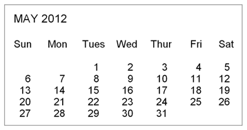

# kalculator - A Fun python3 Calculator 
A simple menu driven calculator for a variety of inputs

kalculator Menu Options
=======================
<dl>
    <dt>Arithmetic Operations on two values<dt>
        <dd>(xy) Exponentiation</dd>
        <dd>(x&times;y) Multiplication</dd>
        <dd>(x&divide;y) Division </dd>
        <dd>(x&#8725;&#8725;y) Floor division or truncating division</dd>
        <dd>(x&percnt;y) Modulus</dd>
        <dd>(x&plus;y) Addititon</dd>
        <dd>(x&minus;y) Subtraction</dd>
    <dt>SETI - Search for Extra-terrestrial Intelligence<dt>
        <dd>Calculating the <i>Drake Equation</i></dd>
        <dd>Dr. Frank Drake conducted the first search for radio signals from
            extraterrestrial civilizations in 1960. This established SETI, a 
            new area of scientific inquiry. In order to estimate the number of
            civilisations that may exist in our galaxy that we may be able to 
            communicate with, he developed what is now called the <i>Drake 
            Equation</i>
        </dd>
        <dd>The Equation is is simply the multiplication of different factors 
            giving N, the estimated number of detectable civilizations
        </dd>
        <dd><a href="static/drake_eq_factors.png">
                N&equals;R&#8729;p&#8729;n&#8729;f&#8729;i&#8729;c&#8729;L
            </a>
        </dd>
    <dt>Calender Month Program</dt>
        <dd>Display a calender month for any given month between January 1800 
            and December 2099
        </dd>
        <dd>
            
        </dd>
    <dt>Age in Seconds</dt>
        <dd>Approximating a person's age in seconds</dd>
        <dd>Works for dates of birth from January 1, 1900 to present</dd>
    <dt>Travelling Salesman Problem</dt>
        <dd>Find all possible routes of travel for salesman needing to visit a 
            given set of cities.
        </dd>
    <dt>Coin Change Exercise Program</dt>
        <dd>An exercise for children learning to count change</dd>
</dl>

Usage
=====
Run:
<pre>
$ <kbd>python3 kalculator.py</kbd>
</pre>

Pseudocode Reference
====================
<<<<<<< HEAD
#Calender month program:
#    
=======
Calender month program:
[An algorithm for determining the day of the week for any date between January 1, 1800 and December 31, 2099.](pseudocode/day_of_week_algorithm_pseudo.txt)
 
[An algorithm for determinig leap years]ph(pseudocode/leap_year_algorithm_pseudo.txt)
>>>>>>> dev-calender

Attribution
===========
“Introduction to Computer Science Using Python: A Computational 
Problem-Solving Focus”, Charles Dierbach, John Wiley, 2012.

[See the Book](http://eu.wiley.com/WileyCDA/Section/id-302479.html?query=Charles+Dierbach)

